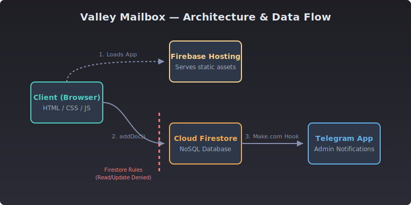

# Valley MailBox 📬


A beautifully themed, Stardew Valley-inspired web application for receiving anonymous or named messages directly from your users. Built with a pristine pixel-art aesthetic, **Valley MailBox** leverages a fully serverless architecture using **Firebase Hosting** and **Cloud Firestore**, with optional push notifications straight to **Telegram**.

## ✨ Features

- **Iconic Pixel-Art Aesthetic:** Authentic 16-bit UI styling complete with parchment dialogue boxes, chunky wooden interactive buttons, pixel input slots, and a parallax falling-leaf background.
- **Form Validation & Character Limits:** Client-side validation ensuring standard data hygiene (e.g., name lengths, 1500 character message caps).
- **Serverless Backend:** Built directly on top of Firebase Cloud Firestore for instantaneous, scalable data storage without managing a server.
- **Bulletproof Security Rules:** Firestore Security Rules explicitly deny all reads/updates/deletes from the web client, ensuring messages are private and tamper-proof. Submissions are strictly validated against field types, lengths, and exact properties to prevent NoSQL injection.
- **Instant Telegram Alerts (Via Make.com):** Never miss a letter. Designed to seamlessly trigger webhooks when a highly-structured document hits Firestore, forwarding it directly to your phone.

---

## 🏗️ Architecture & Data Flow



1. **Client (Web):** The user accesses the static SPA served globally by Firebase Hosting.
2. **Form Submission:** The user fills the themed form. JavaScript validates the inputs and uses the Firebase Client SDK to execute `addDoc()` to the `valley_letters` Firestore collection.
3. **Firestore Security layer:** Before the write is committed, Firebase Security Rules validate that the document shape is exact (no missing or extra fields), types are correct, and strings fall within bounds.
4. **Notification:** A webhook (e.g., Make.com) listens to Firestore and relays the payload to the Telegram Bot API.

---

## 🚀 Getting Started

To run or deploy this project yourself, you will need a Google Firebase account.

### 1. Local Development
Clone the repository and serve the `public/` directory via a local HTTP server:
```bash
cd "Valley MailBox/public"
npx serve
```

### 2. Firebase Setup (Your Own Backend)
If you want to handle your own letters:
1. Create a Firebase Project in the [Firebase Console](https://console.firebase.google.com/).
2. Register a "Web App" to get your Firebase SDK credentials.
3. Replace the `firebaseConfig` object in `public/index.html` with your project's keys.
4. Enable **Firestore Database** in test mode, then deploy the production rules included in this repo.

### 3. Deploy to Firebase Hosting
Ensure you have the Firebase CLI installed:
```bash
npm install -g firebase-tools
firebase login
firebase init
firebase deploy
```

---

## 🔒 Security (Firestore Rules)
The `firestore.rules` file contains the strict schema enforcement. Only the following fields are allowed to enter the database:
- `name` (String, max 80)
- `category` (String Enum)
- `message` (String, max 1500)
- `uid` (String, max 60)
- `contact` (String, optional, max 120)
- `read` (Boolean, must default to false)
- `createdAt` (Timestamp, must strictly equal server time)

All queries or reads originating from the web client are universally denied.

---

## 📱 Telegram Integration (Zero-Code)
You can link this directly to Telegram for free without writing a backend function:
1. Get a bot token from **@BotFather** on Telegram.
2. Get your Chat ID from **@userinfobot**.
3. Create a free account on **Make.com**.
4. Set up a scenario: **Google Cloud Firestore (Watch Documents)** → **Telegram (Send Message)**.

---
*Built from the Valley, for the Valley.* 🌲
